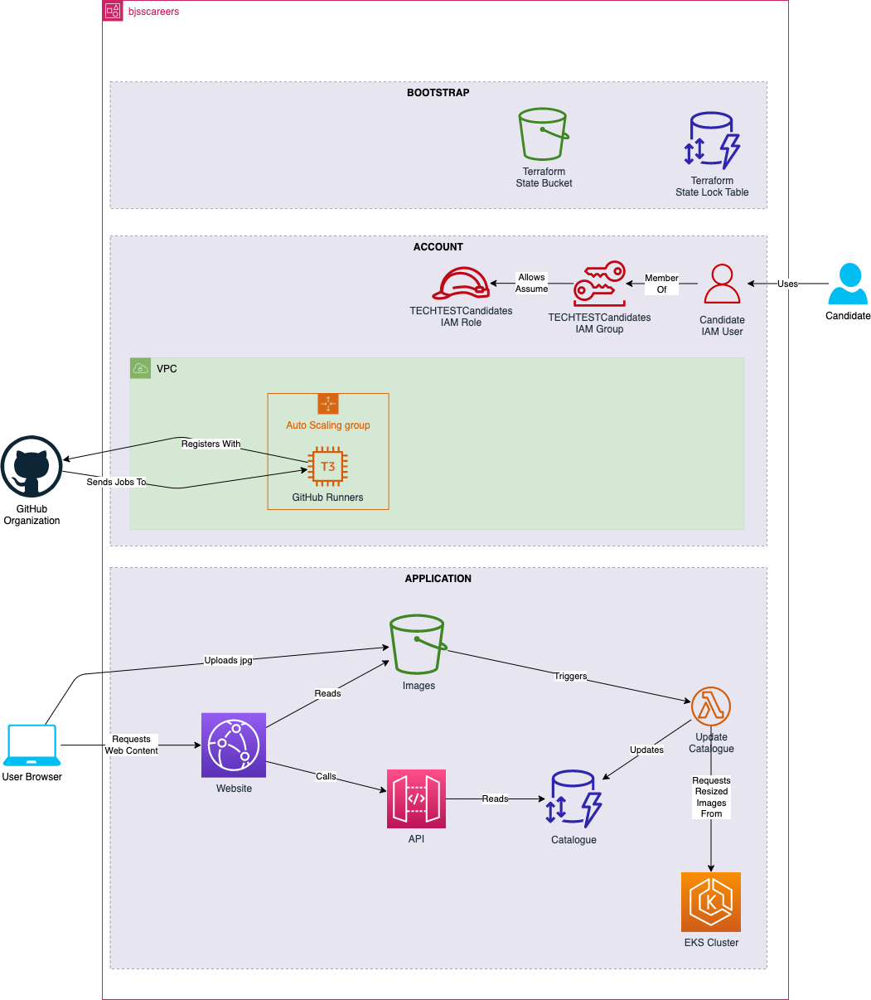

  

# Platform Engineer (AWS) Technical Interview
This repo contains the code used for technical interviewing of Platform Engineering candidates who specialise in AWS and Terraform.

This repo is public to allow candidates to research the code ahead of the interview. The codebase is for a very simple dummy application.

## Candidate Instructions
You are a consultant assigned to a client who runs an existing application in AWS. All of the AWS configuration is deployed using Terraform. All of the CI/CD pipelines are constructed using GitHub Actions. You have been granted access to the application, the AWS account and the GitHub repo.

The application is an image sharing tool. This tool will take an image provided by a user, create copies of it at multiple resolutions, and store them ready to be shared or downloaded.

There are a number of tasks defined in the "issues" tab of the GitHub repo. Each of these is written by the tech lead who is looking for help with a particular part of the solution or project. You should choose one of these tasks to work on. The amount of time you spend on the task is entirely up to you; however, we recommend that you spend at least 1 hour on the task.

Your solution for the task will vary depending on which one you choose, but you should plan to talk about it for around 20 minutes and be prepared to answer clarifying questions about what you present.

After your presentation we will ask you to answer some generic questions about building and running infrastructure and applications in AWS. You don't need to prepare anything in advance for these.

## Notes
- The URL for the deployed application is https://techtest.bjsscareers.co.uk
- Access to the application is restricted by username and password
- You will be provided with login details for the application prior to your interview
- You will use the same login details to access the AWS account that hosts the application
- Once logged in, **you must assume the IAM Role 'TECHTESTCandidates'** in order to have permission to see the contents of the account
- All logins to AWS and the application will be removed after the interview is complete
- You are permitted to upload images to the application in order to test it; however **do not** upload any copyrighted, obscene or offensive materials.
- Your login details are for your sole use. You must not share your login details with anyone else.

## Basic Application Architecture
The diagram below describes how the application fits together at a high level. The source for this diagram is named `architecture.candidate.drawio` and is in the root of this repository. You may take a local copy of this file and enhance it for use in your presentation, if you wish.

